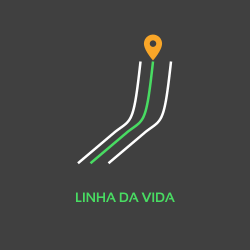
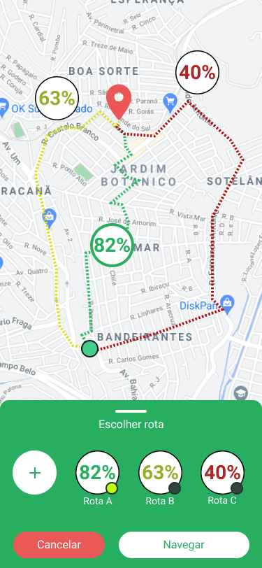

# linha-da-vida

<!-- PROJECT LOGO -->
<br />
<p align="center">
  <a href="https://github.com/othneildrew/Best-README-Template">
    
    
  </a>

  <h2 align="center">Hackathon GOV PE</h2>
  <h3 align="center">Projeto Linha da Vida</h3>

<!-- ABOUT THE PROJECT -->

## Sobre o projeto

<p align="center" width="100%">
  
  
</p>

Um aplicativo com um mapa interativo que pode ser acessado por qualquer cidadão, permitindo traçar e analisar os caminhos mais seguros a se seguir. Por meio de uma interface intuitiva e voltada para o uso rápido, os cidadãos são capazes de registrar cenas e reportar os problemas percebidos nas ruas e avenidas usando categorias sugeridas. Com isso, os indivíduos alimentam um banco de dados que permite mapear, de forma qualitativa, cada irregularidade das vias individualmente.

<p align="center" width="100%">
  
</p>
Conforme se envolvem nessa atividade, os usuários se tornam parte de uma comunidade onde são reconhecidos por contribuírem com seus relatos, podem trocar informações uns com os outros e influenciar de forma mais direta nas decisões tomadas pelas autoridades responsáveis, ganhando reputação na plataforma. Assim como o poder público é possibilitado de notificar à população específica que sofre tais problemas assim que as soluções são implementadas.

<p align="center" width="100%">
  
</p>
Dessa forma fica evidente para o poder público as localidades com maior demanda da população, o que leva a decisões fundamentadas quanto ao destino eficaz da verba pública investida na mobilidade e segurança no trânsito. Realizamos assim nosso objetivo de aproximar o governo da população e caminhar em direção à visão zero.

### Construído com

- React Native
- Typescript
- Node.js

## Instruções para rodar o projeto na sua máquina

### Pré-requisitos

Lista de softwares necessários para rodar o projeto na máquina

- `npm`: node package manager
  ```sh
  npm install npm@latest -g
  ```
- `yarn`

  ```sh
  curl -sS https://dl.yarnpkg.com/debian/pubkey.gpg | sudo apt-key add -
  echo "deb https://dl.yarnpkg.com/debian/ stable main" | sudo tee /etc/apt/sources.list.d/yarn.list

  sudo apt update && sudo apt install yarn
  ```

- `Expo CLI`

  ```sh
  npm install -g expo-cli
  ```

- `Expo Client`: baixe o cliente no seu dispositivo móvel

### Instalação

1. Clone o repositório
   ```sh
   git clone https://github.com/linha-da-vida/app
   ```
2. Instale os pacotes NPM utilizando o `yarn`

   ```sh
   yarn
   ```

3. Aplique os patches nas dependências que necessitam com o comando

   ```sh
   patch-package
   ```

   Leia mais em: https://github.com/ds300/patch-package

4. Crie o arquivo `.env` na raiz do projeto para armazenar as variáveis de ambiente segundo as instruções contidas em .env.template

   ```sh
    # Endereço do host do servidor
    SERVER_URI=192.168.XY.Z:3000
   ```

5. Configure o servidor disponível em: https://github.com/linha-da-vida/server

## Uso

Após verificar que todas os pré-requisitos são cumpridos e instalar o repositório, para utilizá-lo, basta executar um único comando:

```sh
yarn start
```

Isso dará início ao projeto com Expo. Utilize o cliente mobile para ler o QR Code no console e dar início à aplicação no seu celular.

<!-- LICENSE -->

## License

Distribuído sob a licença MIT. Veja `LICENSE` para mais informações.
